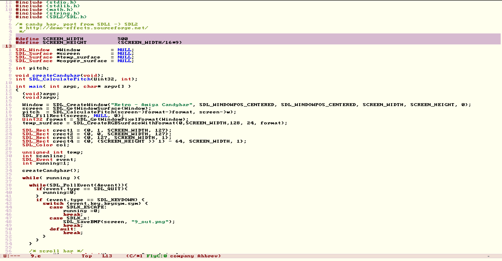

# Yotsuba Theme for Emacs

A light color theme for Emacs inspired by the **Yotsuba** aesthetic of the 4chan imageboard.

This theme maps the original CSS palette to Emacs faces, providing a environment for programmers and writers who appreciate the "old web" design.

## Screenshots



## Features

- **Authentic Palette:** Uses the exact hex codes (#FFFFEE, #F0E0D6, #800000) from the original site.
- **Contextual Syntax:**
  - **Greentext Comments:** Code comments are rendered in the quote green (#789922).
  - **Subject Headers:** Keywords and headings use the maroon subject color (#800000).
  - **User Strings:** Strings are colored in the username/tripcode green (#117743).
- **Lightweight:** Pure Elisp with no external dependencies.

## Installation

### Manual
1. Download `yotsuba-theme.el`.
2. Move it to your `~/.emacs.d/themes/` directory.
3. Add the following to your `init.el` or `.emacs`:

```elisp
(add-to-list 'custom-theme-load-path "~/.emacs.d/themes/")
(load-theme 'yotsuba t)

