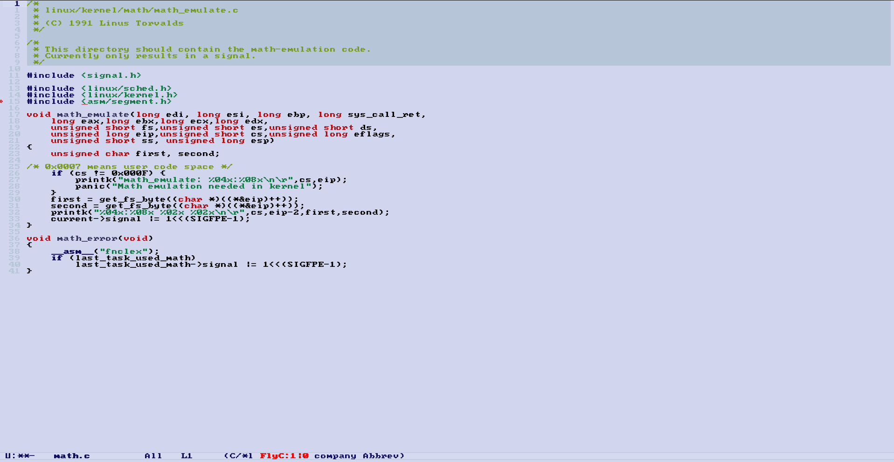

# Yotsuba Theme for Emacs

A light color theme for Emacs inspired by the **Yotsuba** aesthetic of the 4chan imageboard.

This theme maps the original CSS palette to Emacs faces, providing a environment for programmers and writers who appreciate the "old web" design.

## Screenshots




## Features

- **Authentic Palette:** Uses the exact hex codes (#FFFFEE, #F0E0D6, #800000) from the original site.
- **Contextual Syntax:**
  - **Greentext Comments:** Code comments are rendered in the quote green (#789922).
  - **Subject Headers:** Keywords and headings use the maroon subject color (#800000).
  - **User Strings:** Strings are colored in the username/tripcode green (#117743).
- **Lightweight:** Pure Elisp with no external dependencies.

## Installation

### Manual Installation

1. Clone the repository to your themes directory:
   ```bash
   git clone [https://github.com/Senka07/yotsuba-emacs-theme.git](https://github.com/Senka07/yotsuba-emacs-theme.git) ~/.emacs.d/themes/

    Add the following to your init.el:
    

    ;; Add the theme directory to load-path
    (add-to-list 'custom-theme-load-path "~/.emacs.d/themes/")

    ;; Load the theme:
    (load-theme 'yotsuba t)
    

### Installation via use-package (Straight.el / Quelpa)

If you use straight.el or quelpa, add this to your configuration:

```elisp
(use-package yotsuba-theme
  :straight (:host github :repo "Senka07/yotsuba-emacs-theme")
  :init
  (load-theme 'yotsuba t))
```

